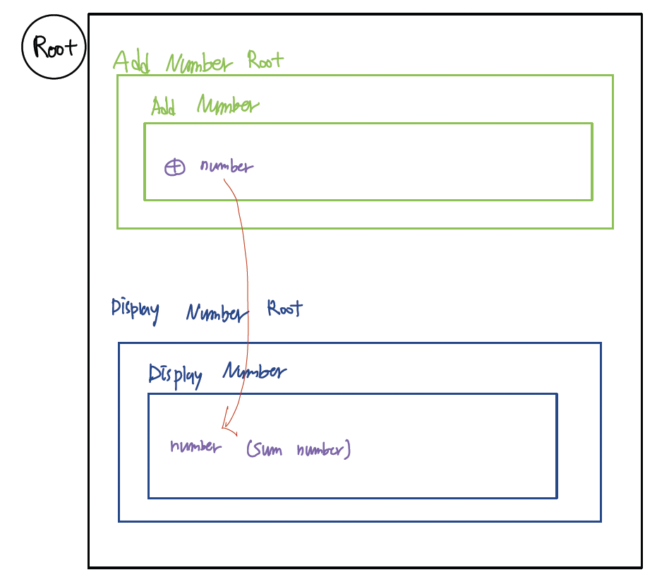

# React-Redux

---

- React: a technology that allows you to create systematic and well-organized applications by creating custom tags, i.e. components.

- Redux: a technology that reduces the possibility of data being transformed in an unpredictable direction by centrally managing the state.

- Technology that reduces the complexity of development.

---


- React is like a rumor.
  React is like a society made up of components, and if a change occurs (data representing the change is generated), the change is transmitted to all components. --> Performance deteriorates because the render function is called.

- As applications become more complex, it becomes more difficult to construct them using only React.

- React is like a rumor.
  React is like a society made up of components, and if a change occurs (data representing the change is generated), the change is transmitted to all components. --> Performance deteriorates because the render function is called.

As applications become more complex, it becomes more difficult to construct them using only React.

- Redux is like media.
  When a change occurs, the change can be easily communicated by notifying the media outlet called Redux's store.

- However, both have the inefficiency of being delivered to members who do not need it.

- Therefore, by using React-Redux, a library that connects React and Redux, the news can be delivered only to the members who need it.

---

## Study Plan

1. simple react component structure without redux

2. react component state connect without redux

3. Add redux

---

## simple react components structure without redux

- Divided components by 'AddNumberRoot', 'AddNumber', 'DisplayNumberRoot', and 'DisplayNumber'

## 

---

## react components state connect without redux

- You can use props when passing data from parent to child, and pass callback functions as props when passing data from child to parent to update the parent's state.

```JavaScript
<AddNumberRoot
  onClick={function (size) {
    this.setState({ number: this.state.number + size });
  }.bind(this)}
></AddNumberRoot>
```

--> In the AddNumberRoot component, we are passing a function through the onClick prop. The function takes a parameter named size and its job is to increment the current state of number by size.

```JavaScript
<AddNumber
  onClick={function (size) {
    // alert("size : " + size); //->test
    this.props.onClick(size);
  }.bind(this)}
></AddNumber>
```

--> The AddNumber component is also passing a function through the onClick prop. This function is responsible for taking a size and passing that size to the parent component.

```JavaScript
<input
  type="button"
  value="+"
  onClick={function () {
    this.props.onClick(this.state.size);
  }.bind(this)}
></input>

<input
  type="text"
  value={this.state.size}
  onChange={function (e) {
    this.setState({ size: Number(e.target.value) });
  }.bind(this)}
></input>
```

--> Inside the AddNumber component, we're using the input element to set and pass values: when the + button is pressed, we call this.props.onClick(this.state.size) to pass the size value to the parent component, and we manipulate the size value through the input element.

\*\*\* A structure that interacts between the AddNumberRoot and the AddNumber component, and passes state within the AddNumber component to the parent component. This allows you to implement a data flow where data is passed from parent to child, and child to parent.

--> If application is very deep, or has a lot of components, this is absolutely not efficient.

---

## Add Redux

- Why use Redux?
  --> Using React alone, like the code before, a change in a child component called A would require a trip up to the root and back down again to affect another neighboring component called B. This is a pain. This is where Redux comes in. Redux is useful because it can handle changes in a centralized way.

[store.js]
--> Create a Store.js to create a central processing unit

\*\* old ver.

```JavaScript
import { createStore } from "redux";

//reducer
export default createStore(function (state, action) {
	if (state === undefined) {
		return { number: 0 };
	}
	if (action.type === "INCREMENT") {
		// return { number: state.number + action.size };
		return { ...state, number: state.number + action.size };
	}
  return state;
});
```

\*\* new ver.

```JavaScript
import { createStore } from "redux";

// reducer
const reducer = function (state, action) {
	if (state === undefined) {
		return { number: 0 };
	}
	if (action.type === "INCREMENT") {
		// return { number: state.number + action.size };
		return { ...state, number: state.number + action.size };
	}
  return state; // Your actual logic goes here
};

export default createStore(
	reducer,
	window.__REDUX_DEVTOOLS_EXTENSION__ && window.__REDUX_DEVTOOLS_EXTENSION__()
);
```

[AddNumber.jsx]
--> Sending new values to reducers using dispatch

```JavaScript
import store from "../store";

<input
  type="button"
  value="+"
  onClick={function () {
    store.dispatch({ type: "INCREMENT", size: this.state.size });
  }.bind(this)}
></input>
```

[DisplayNumber.jsx]
--> Receiving and applying changing state values from a centralized processor via a subscription

```JavaScript
state = { number: store.getState().number };

constructor(props) {
  super(props);
  store.subscribe(
    function () {
      this.setState({ number: store.getState().number });
    }.bind(this)
  );
}

render() {
  return (
    <div>
      <h1>Display number</h1>
      <input type="text" value={this.state.number} readOnly></input>
    </div>
  );
}
```

---

## Removing Redux-dependent features from React components 01 AddNumber

\*\* Previous - React only

```JavaScript
import React, { Component } from "react";

export default class AddNumber extends Component {
	state = { size: 1 };
	render() {
		return (
			<div>
				<h1>Add number</h1>
				<input
					type="button"
					value="+"
					onClick={function () {
						this.props.onClick(this.state.size);
					}.bind(this)}
				></input>
				<input
					type="text"
					value={this.state.size}
					onChange={function (e) {
						this.setState({ size: Number(e.target.value) });
					}.bind(this)}
				></input>
			</div>
		);
	}
}

```

\*\* After adding Redux

```JavaScript
import React, { Component } from "react";
import store from "../store";

export default class AddNumber extends Component {
	state = { size: 1 };
	render() {
		return (
			<div>
				<h1>Add number</h1>
				<input
					type="button"
					value="+"
					onClick={function () {
						store.dispatch({ type: "INCREMENT", size: this.state.size });
					}.bind(this)}
				></input>
				<input
					type="text"
					value={this.state.size}
					onChange={function (e) {
						this.setState({ size: Number(e.target.value) });
					}.bind(this)}
				></input>
			</div>
		);
	}
}
```

--> The old code was worth its weight in parts.

- It can be used in several places within this application
- You can use it in other applications if you want

This is because you can provide an event handler with a prop called onClick, which will fire the event handler on button click.

But, code which is changed after adding redux relies on Redux's store, which means it can't be reused because it depends on the state that this application is using.

- How can we solve this problem?
  --> 'wrapping' // You can do this by creating a "container component" that wraps the ed number and handles the redundancy-related functions in the current [AddNumber.jsx] instead.

1. create a Containers folder and create the [AddNumber.jsx] file

2.

```JavaScript
import AddNumber from "../components/AddNumber";
import React, { Component } from "react";

export default class extends Component {
	render() {
		return <AddNumber
				onClick={function (size) {
					store.dispatch({ type: "INCREMENT", size: size });
				}.bind(this)}
			></AddNumber>;
	}
}
```

3. in [AddNumberRoot.jsx], replace the incoming file from 'component/AddNumber' to 'container/AddNumber'.

4. move the dispatch part of the existing [AddNumber.jsx] file to the new [AddNumber.jsx] file and change the code so that the old part can function as a component again.

> Increase reusability of existing [AddNumber.jsx] files by breaking dependencies by making new files interact with redux and depend on redux, while existing files act as components, creating a middle bridge.

---

##
